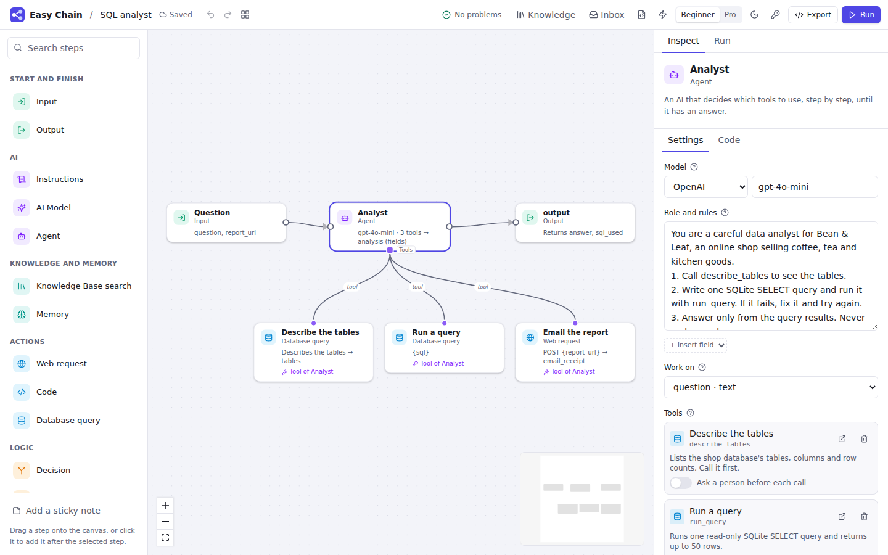
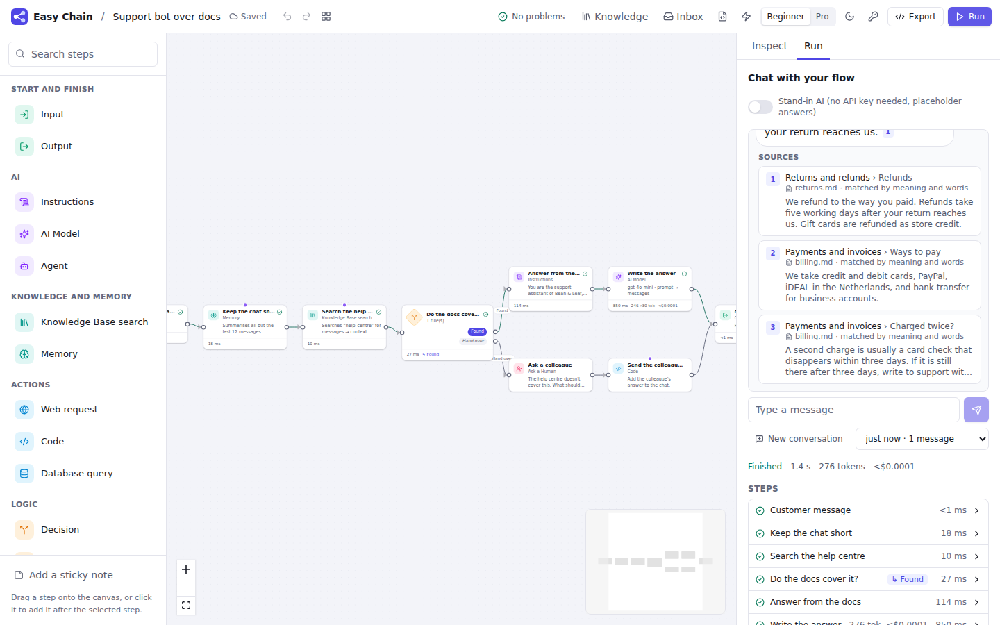
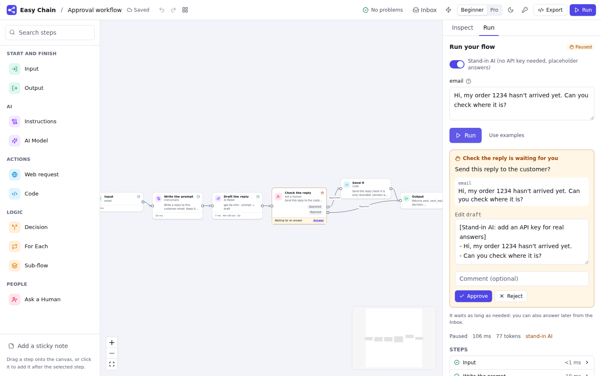

# Easy Chain

**Draw your AI app, press Run, watch it think, ship it with one click.**

Easy Chain is an open-source, drag-and-drop builder for LLM apps and AI agents, made for
low-code builders: analysts, operations and product people, consultants. It is a visual layer
on top of the real LangChain stack, not a replacement for it. Every flow compiles to plain
LangGraph code. That same code runs when you press Run and is what you get when you export,
with no Easy Chain runtime required.


> **Status: Phase 3 (Agents and knowledge) of the build plan** ([Phase 3 report](docs/phases/phase-3.md),
> [Phase 2](docs/phases/phase-2.md), [Phases 0 and 1](docs/phases/phase-0-1.md)). Agents use
> your steps, APIs, databases and MCP servers as tools, with a person approving what matters;
> Knowledge Bases answer from your documents with citations; runs are durable and can wait for
> people as long as it takes. Autopilot agents, evaluation and one-click publishing come in later
> phases (see the [roadmap](#roadmap)).

## Quick start

**With Docker (one command):**

```bash
docker compose up        # Postgres + API + a worker; open http://localhost:8000
docker compose up --scale worker=3   # more workers; stopping or killing one is safe
```

**From source** (needs [uv](https://docs.astral.sh/uv/) and [pnpm](https://pnpm.io/), Node 20+):

```bash
make install
make dev                 # API on :8000, web app on http://localhost:5173
```

Then pick a template and press **Try it**. No API key yet? Switch on the **stand-in AI** in the
Run panel to see the flow work with placeholder answers, or add your key under **Settings → Keys
and providers** (it is stored encrypted on your machine and never saved in flows or exports).
The *Support bot over docs* and *SQL analyst* templates come with a sample help centre and shop
database, so they work straight away.

**From the command line:**

```bash
cd python
uv run easychain run ../examples/hello.flow.yaml -i question="What is LangGraph?" --stand-in
uv run easychain export ../examples/hello.flow.yaml -o hello/   # a standalone LangGraph project
uv run easychain worker --database-url postgresql://…           # a worker for a shared database
```

## What you get

### Phase 3: agents and knowledge

| | |
|---|---|
| **Agent step** | An AI that calls tools until it has an answer (`create_agent`). Any Web request, Code, Sub-flow, Knowledge Base search, Database query, MCP tool or Memory step becomes a tool: drag it onto the agent's **Tools** handle and describe it. Tool calls show live under the agent and in the trace. |
| **Add-ons** | Agent middleware behind toggles: **ask a person before** a tool runs (approve, edit or reject in the run panel or Inbox), call limits, retries, fallback models, summarising long chats, personal data filters, tool selection, a to-do list, long-term memory. |
| **Knowledge Bases** | Upload PDF, Word, HTML, Markdown, CSV or text, or add web pages; see how they split; search by meaning, words, or both (hybrid), with optional re-ranking. Answers cite `[1]` and the run panel links each citation to its passage, page and heading. pgvector on Postgres, SQLite locally. |
| **Structured replies** | A field builder for the AI Model and Agent: text, numbers, yes/no, choices, lists, nested groups. Replies are validated, retried when they don't fit, and each field can go straight into Flow Data. |
| **Tools from everywhere** | **MCP servers** (HTTP, or approved local commands) in Settings; **Import an API** from an OpenAPI description into typed Web request steps; a **Database query** step that is read-only unless you say otherwise; a **Memory** step to remember facts about a user, or keep a long chat short. |
| **14 model providers** | OpenAI, Anthropic, Ollama, Google Gemini and Vertex AI, AWS Bedrock, Azure OpenAI, Mistral, Groq, Together, Fireworks, OpenRouter, DeepSeek and xAI, plus eight embedding model families. |

See [docs/agents.md](docs/agents.md) and [docs/knowledge.md](docs/knowledge.md).





### Phase 2: a real runtime

| | |
|---|---|
| **Durable runs** | Runs, their events and Save Points live in SQLite (local) or Postgres. A queue hands runs to workers; if a worker dies, another carries the run on from its last Save Point. Finished steps never run again, and side effects (POST requests, Code marked *run at most once*) are remembered and carry an `Idempotency-Key`, so nothing is sent twice. |
| **Ask a Human and the Inbox** | A step that pauses the run until a person approves, edits, answers or picks an option, in the run panel or the **Inbox**, a minute or a week later. Notifications by webhook, Slack or email. |
| **Loops, branches and lists** | Round limits on Decisions, **Jump** (set data and pick the next step), parallel branches that **wait for all**, **For Each** with a concurrency limit, and **Sub-flows** (a flow as a step; double-click to open it). |
| **Per-step run policy** | Retries with backoff, time limits, a cache for repeated inputs. Flow settings for max rounds, parallelism, runs at once, and what happens when a chat gets a second message while busy. |
| **Flow Data panel** | Declare fields with types and update rules: replace, add to the list, add up, merge, or a custom Python `combine(old, new)`. |
| **Debugging** | Breakpoints before or after any step, **Save Points** with the Flow Data at each one, and **run again from here** with edited values (time travel). Stop a run and carry it on later. Runs keep going if you reload the page. |
| **Triggers and the API** | Start flows from a webhook, a schedule (cron with time zones), a file upload, or when another flow finishes. Follow any run over SSE (`Last-Event-ID` resumes) or a WebSocket, and use [`@easychain/client`](packages/client) with its React hook in your own app. |

See [docs/runs.md](docs/runs.md) for how runs, workers, the Inbox, triggers and the API work.



### Phase 1: the visual builder

| | |
|---|---|
| **Canvas** | Drag steps from a searchable Step library, connect them, auto-layout, minimap, sticky notes, undo/redo, copy/paste across flows, keyboard shortcuts. Dropping a connection on empty canvas offers to add a step there. Invalid connections explain why. |
| **Inspector** | A form for every step, with tooltips and examples, **More options** for advanced settings, and a **Code** tab showing the LangGraph code each step compiles to. |
| **Checks before a run** | Missing inputs, misspelt `{variables}` ("Did you mean `{page}`?"), unreachable steps, loops with no way out, missing API keys. Each problem is pinned to a step, and many have a one-click fix. |
| **See it think** | The active step glows, tokens stream inside the AI step, data pulses along connections, Decisions highlight the exit they took, and each step shows its time, tokens and cost. Click any step in the trace to see what it read and saved. **Run Replay** plays a past run back on the canvas. |
| **Fail loudly and helpfully** | Errors appear on the step that failed, in plain words ("The web request got 404 Not Found from example.com"), with buttons such as **Add your API key** or **Try with the stand-in AI**. |
| **Chat and forms** | Chat flows get a chat panel that remembers the conversation; other flows get a form generated from their inputs. |
| **Export** | A zip with idiomatic, commented Python (`langgraph` + `langchain` only), `requirements.txt`, `langgraph.json` for `langgraph dev`, and the flow file. |
| **Beginner and Pro modes** | Pro mode shows the LangChain/LangGraph term next to each name, advanced settings, step ids and Decision expressions. Light and dark themes. |

### The steps

| Easy Chain name | LangChain-stack term | What it does |
|---|---|---|
| Input | `START` + input schema | Where a run starts: form fields, or chat messages |
| Instructions | `ChatPromptTemplate` | A prompt with `{variables}` filled from Flow Data |
| AI Model | chat model via `init_chat_model` | Sends text or a prompt to a model; free text or fixed fields (`with_structured_output`) |
| Agent | `create_agent` + middleware | Calls tools (other steps, MCP servers) until it has an answer |
| Web request | HTTP request tool | Fetches a page (as readable text) or calls an API |
| Code | Python function | `run(data)` returns the Flow Data fields to update |
| Decision | conditional edge | Picks an exit by rules, a safe expression, or by asking an AI; round limits for loops |
| For Each | `Send` (map-reduce) | Runs a step for every item of a list, side by side, and collects the results in order |
| Sub-flow | subgraph | Runs another flow as one step, with shared or mapped Flow Data |
| Jump | `Command(update, goto)` | Sets Flow Data and picks the next step in one move (Pro) |
| Ask a Human | `interrupt()` | Pauses until a person approves, edits, answers or chooses |
| Knowledge Base search | retriever (hybrid search) | Finds the passages that answer a question, numbered for citing |
| Memory | LangGraph store, `trim_messages` | Remembers facts about a user, or keeps a long chat short |
| Database query | SQL tool (SQLAlchemy) | Runs read-only SQL with safe parameters, or describes the tables |
| MCP tool | `langchain-mcp-adapters` | Calls a tool on a connected MCP server |
| Output | `END` + output schema | Chooses what a run returns |

Each has a docs page in [`docs/steps/`](docs/steps).

## How it works

```
 canvas (React Flow) ──► flow spec (YAML) ──► compiler ──► LangGraph Python ──► run (stream events)
                                                     └──────────────────────────► export (zip)
```

1. A flow is a **flow spec**: a readable YAML file ([format](docs/flow-spec.md),
   [JSON Schema](spec/flow.schema.json)), kept in a folder you can put in git.
2. The **compiler** turns it into a LangGraph module: Flow Data becomes a `TypedDict` state
   with reducers, steps become nodes, Decisions become conditional edges.
3. **Run** queues the run; a **worker** executes exactly that module with a Postgres or SQLite
   checkpointer, writing per-step events that the canvas (or your app) streams. **Export** writes
   the same module to a zip.

See [ARCHITECTURE.md](ARCHITECTURE.md) for the details and the decisions behind them.

## Project layout

```
apps/web/            React + TypeScript web app (React Flow, Tailwind, Zustand, Monaco)
packages/client/     @easychain/client: TypeScript client and React hook for the runs API
python/              the `easychain` Python package: spec, compiler, runtime, API server, workers, CLI
  src/easychain/templates/   starter flows and their Test Sets
  tests/                     unit, golden, behaviour, server and export tests
spec/flow.schema.json        published JSON Schema for flow files
examples/                    example flows
docs/                        flow spec, step pages, phase reports
```

## Development

```bash
make test        # Python tests + web and client unit tests
make e2e         # Playwright: build, run, debug, export, Ask a Human, Inbox, Save Points, triggers,
                 # agents and tool approval, Knowledge Bases and citations, MCP, API import, a11y
make worker      # a separate worker process (run the server with EASYCHAIN_WORKER=off)
make lint        # ruff + TypeScript
make golden      # regenerate compiler golden files after an intended change
```

The end-to-end and template tests use a small fake OpenAI-compatible server
(`python -m easychain.testing.fake_openai`, with tool calls, structured replies and embeddings)
and a small MCP server (`python -m easychain.testing.mcp_server`), so nothing calls a paid API. The queue and crash
tests run on SQLite and, when Postgres is installed (or `EASYCHAIN_TEST_POSTGRES_URL` is set),
on Postgres too. See
[CONTRIBUTING.md](CONTRIBUTING.md) for adding a step type.

**Picking the project up?** Start with [AGENTS.md](AGENTS.md) and
[docs/handover](docs/handover/README.md): the current status, every decision made so far, the
traps already found, and how to set up a machine.

## Roadmap

| Phase | Scope | Status |
|---|---|---|
| 0. Foundations | Monorepo, CI, Docker Compose, flow spec, compiler, CLI | ✅ Done |
| 1. Visual MVP | Canvas, Step library, inspector, Input / AI Model / Instructions / Action / Decision / Output, three providers, streaming chat, run trace, Python export | ✅ Done |
| 2. Real runtime | Flow Data panel and update rules, loops with guards, parallel branches, For Each, Sub-flows, Postgres Save Points, crash recovery, Ask a Human and Inbox, time travel, background runs, triggers | ✅ Done |
| 3. Agents and knowledge | Agent step and add-ons, MCP, OpenAPI import, structured output, Knowledge Base, memory, all providers | ✅ Done |
| 4. Autopilot and teams | Deep Agents, Helpers, Skills, sandboxes, multi-agent patterns, describe-it copilot | Next |
| 5. Platform | Test Sets and Checks, Test Runs, CI gate, dashboards, model gateway, Publish, environments, roles, SSO | |
| 6. Ecosystem | LangGraph.js export, custom module registry, import, collaboration, prompt optimisation, Helm | |

## Licence

[Apache 2.0](LICENSE).
