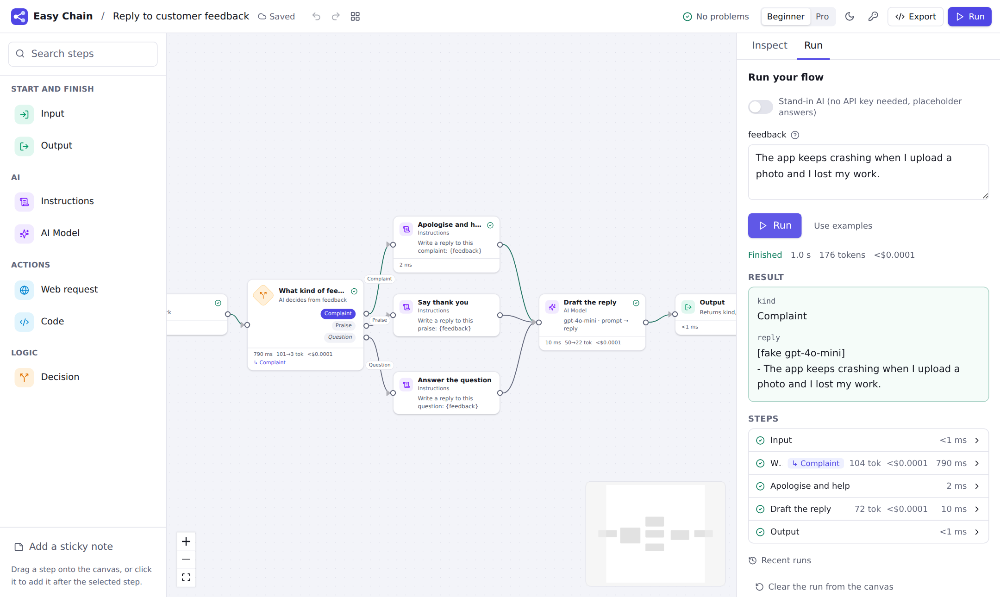

# Easy Chain

**Draw your AI app, press Run, watch it think, ship it with one click.**

Easy Chain is an open-source, drag-and-drop builder for LLM apps and AI agents, made for
low-code builders: analysts, operations and product people, consultants. It is a visual layer
on top of the real LangChain stack, not a replacement for it. Every flow compiles to plain
LangGraph code. That same code runs when you press Run and is what you get when you export,
with no Easy Chain runtime required.



> **Status: Phase 1 (Visual MVP) of the [build plan](docs/phases/phase-0-1.md).** You can build,
> run, debug and export flows made of Input, Instructions, AI Model, Web request, Code, Decision
> and Output steps, using OpenAI, Anthropic or local Ollama models. Agents, knowledge bases,
> durable runs, evaluation and one-click publishing come in later phases (see the
> [roadmap](#roadmap)).

## Quick start

**With Docker (one command):**

```bash
docker compose up        # then open http://localhost:8000
```

**From source** (needs [uv](https://docs.astral.sh/uv/) and [pnpm](https://pnpm.io/), Node 20+):

```bash
make install
make dev                 # API on :8000, web app on http://localhost:5173
```

Then pick a template and press **Try it**. No API key yet? Switch on the **stand-in AI** in the
Run panel to see the flow work with placeholder answers, or add your key under **Settings → API
keys** (it is stored encrypted on your machine and never saved in flows or exports).

**From the command line:**

```bash
cd python
uv run easychain run ../examples/hello.flow.yaml -i question="What is LangGraph?" --stand-in
uv run easychain export ../examples/hello.flow.yaml -o hello/   # a standalone LangGraph project
```

## What you get in Phase 1

| | |
|---|---|
| **Canvas** | Drag steps from a searchable Step library, connect them, auto-layout, minimap, sticky notes, undo/redo, copy/paste across flows, keyboard shortcuts. Dropping a connection on empty canvas offers to add a step there. Invalid connections explain why. |
| **Inspector** | A form for every step, with tooltips and examples, **More options** for advanced settings, and a **Code** tab showing the LangGraph code each step compiles to. |
| **Checks before a run** | Missing inputs, misspelt `{variables}` ("Did you mean `{page}`?"), unreachable steps, loops with no way out, missing API keys. Each problem is pinned to a step, and many have a one-click fix. |
| **See it think** | The active step glows, tokens stream inside the AI step, data pulses along connections, Decisions highlight the exit they took, and each step shows its time, tokens and cost. Click any step in the trace to see what it read and saved. **Run Replay** plays a past run back on the canvas. |
| **Fail loudly and helpfully** | Errors appear on the step that failed, in plain words ("The web request got 404 Not Found from example.com"), with buttons such as **Add your API key** or **Try with the stand-in AI**. |
| **Chat and forms** | Chat flows get a chat panel that remembers the conversation; other flows get a form generated from their inputs. |
| **Export** | A zip with idiomatic, commented Python (`langgraph` + `langchain` only), `requirements.txt`, `langgraph.json` for `langgraph dev`, and the flow file. |
| **Beginner and Pro modes** | Pro mode shows the LangChain/LangGraph term next to each name, advanced settings, step ids and Decision expressions. Light and dark themes. |

### The steps

| Easy Chain name | LangChain-stack term | What it does |
|---|---|---|
| Input | `START` + input schema | Where a run starts: form fields, or chat messages |
| Instructions | `ChatPromptTemplate` | A prompt with `{variables}` filled from Flow Data |
| AI Model | chat model via `init_chat_model` | Sends text or a prompt to OpenAI, Anthropic or Ollama |
| Web request | HTTP request tool | Fetches a page (as readable text) or calls an API |
| Code | Python function | `run(data)` returns the Flow Data fields to update |
| Decision | conditional edge | Picks an exit by rules, a safe expression, or by asking an AI |
| Output | `END` + output schema | Chooses what a run returns |

Each has a docs page in [`docs/steps/`](docs/steps).

## How it works

```
 canvas (React Flow) ──► flow spec (YAML) ──► compiler ──► LangGraph Python ──► run (stream events)
                                                     └──────────────────────────► export (zip)
```

1. A flow is a **flow spec**: a readable YAML file ([format](docs/flow-spec.md),
   [JSON Schema](spec/flow.schema.json)), kept in a folder you can put in git.
2. The **compiler** turns it into a LangGraph module: Flow Data becomes a `TypedDict` state
   with reducers, steps become nodes, Decisions become conditional edges.
3. **Run** executes exactly that module, streams per-step events to the canvas, and records the
   trace. **Export** writes the same module to a zip.

See [ARCHITECTURE.md](ARCHITECTURE.md) for the details and the decisions behind them.

## Project layout

```
apps/web/            React + TypeScript web app (React Flow, Tailwind, Zustand, Monaco)
python/              the `easychain` Python package: spec, compiler, runtime, API server, CLI
  src/easychain/templates/   starter flows and their Test Sets
  tests/                     unit, golden, behaviour, server and export tests
spec/flow.schema.json        published JSON Schema for flow files
examples/                    example flows
docs/                        flow spec, step pages, phase reports
```

## Development

```bash
make test        # Python tests (170) + web unit tests
make e2e         # Playwright: build → run → debug → export, templates, a11y, 300-step canvas
make lint        # ruff + TypeScript
make golden      # regenerate compiler golden files after an intended change
```

The end-to-end and template tests use a small fake OpenAI-compatible server
(`python -m easychain.testing.fake_openai`), so nothing calls a paid API. See
[CONTRIBUTING.md](CONTRIBUTING.md) for adding a step type.

## Roadmap

| Phase | Scope | Status |
|---|---|---|
| 0. Foundations | Monorepo, CI, Docker Compose, flow spec, compiler, CLI | ✅ Done |
| 1. Visual MVP | Canvas, Step library, inspector, Input / AI Model / Instructions / Action / Decision / Output, three providers, streaming chat, run trace, Python export | ✅ Done |
| 2. Real runtime | Flow Data panel and update rules, loops with guards, parallel branches, For Each, Sub-flows, Postgres Save Points, crash recovery, Ask a Human and Inbox, time travel, background runs, triggers | Next |
| 3. Agents and knowledge | Agent step and add-ons, MCP, OpenAPI import, structured output, Knowledge Base, memory, all providers | |
| 4. Autopilot and teams | Deep Agents, Helpers, Skills, sandboxes, multi-agent patterns, describe-it copilot | |
| 5. Platform | Test Sets and Checks, Test Runs, CI gate, dashboards, model gateway, Publish, environments, roles, SSO | |
| 6. Ecosystem | LangGraph.js export, custom module registry, import, collaboration, prompt optimisation, Helm | |

## Licence

[Apache 2.0](LICENSE).
