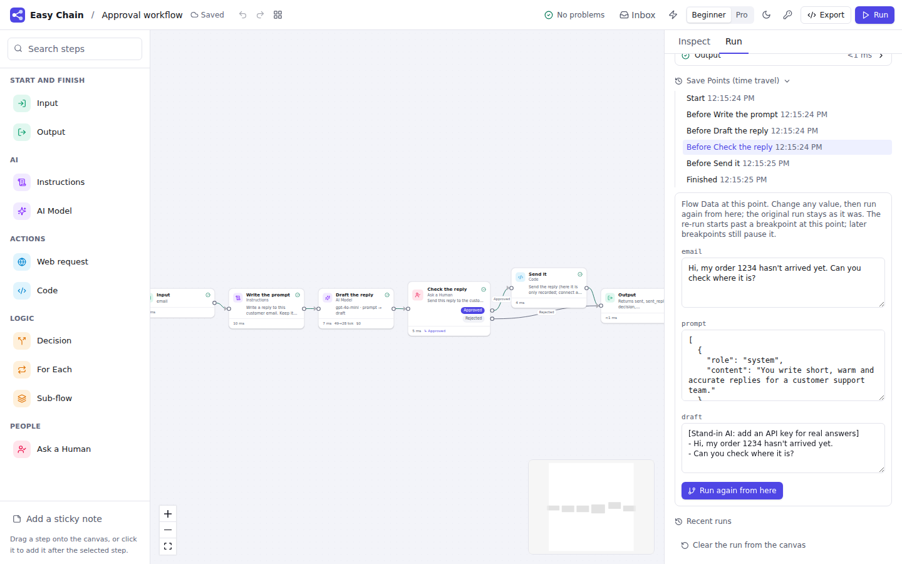
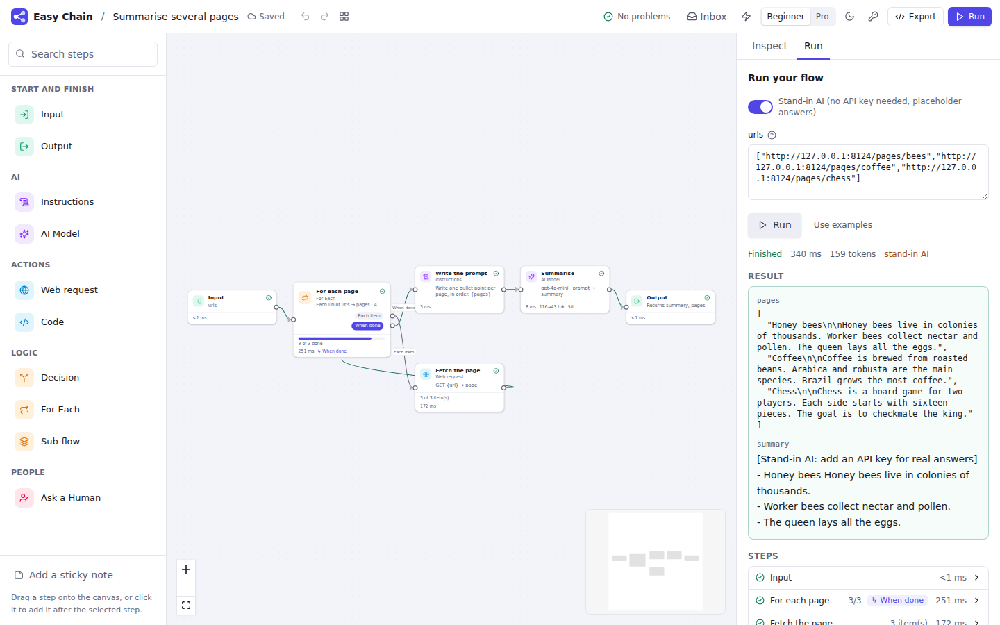
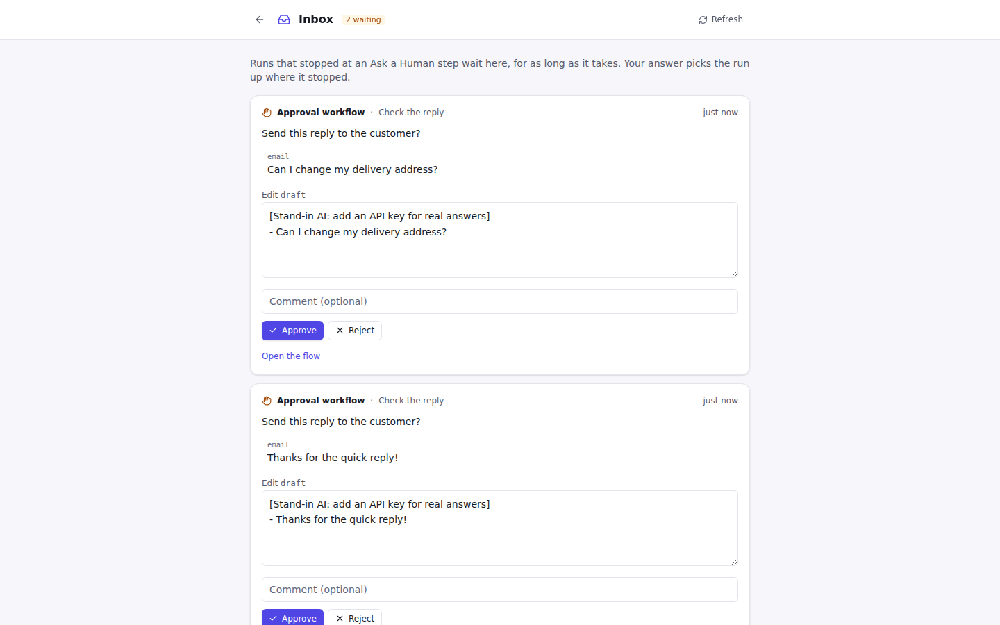

# Phase 2: report

**Status: Phase 2 (Real runtime) meets its "Done when".** Work stops here for review before
Phase 3, as the build prompt asks.

The three questions from the [Phase 0 and 1 report](phase-0-1.md) were answered "whatever you
think is right", so Phase 2 went with the recommendations: flows stay YAML files (runs, versions
and Save Points go in the database), the job queue is a Postgres table (no Redis yet), and Code
steps keep running unsandboxed until Phase 4.

## Done when

| Done when | Evidence |
|---|---|
| Killing a worker mid-run and restarting resumes from the last step | `python/tests/test_durability.py::test_killed_worker_resumes_from_the_last_step_without_repeating_side_effects`. Real `easychain worker` processes; the worker is killed with **SIGKILL** half-way through a slow step, after a POST has already gone out. A new worker takes the job over and finishes the run: the finished step is not run again, the interrupted step runs again, the run ends `ok`. Runs on **SQLite and Postgres**. Repeated 3 times in a row on both (18 runs, all passed). |
| …with no duplicate side effects | The same test checks the fake service received each POST exactly once. `test_side_effect_interrupted_by_a_crash_is_not_applied_twice` kills the worker *after* a payment request was sent but *before* the step finished: the step runs again and sends again, with the **same Idempotency-Key**, so the payment happens once. `test_retries_send_the_same_idempotency_key` does the same for retries. |
| A paused approval can be resumed a day later | `test_paused_approval_is_resumed_a_day_later`: the run pauses at Ask a Human; the worker is stopped; the run's and Inbox item's timestamps are moved back 24 hours; then a **fresh API server** (no worker inside) and a **fresh worker** start, the item is answered through `/api/inbox/{id}/answer` (a second answer is refused), and the run finishes with the edited draft. SQLite and Postgres. |
| (also checked by hand) | The Docker image ran as an API container plus two worker containers on Postgres; one worker container was killed with `docker kill` mid-run; the other took the run over once the lease ran out and finished it without repeating the first step. |

## What was built

**Graph features** (all compile to plain LangGraph; [docs/steps](../steps))

- **Flow Data panel:** declare fields with a type and an update rule: replace, add to the list,
  add up, merge, or (Pro) a custom Python `combine(old, new)` that becomes the field's reducer.
- **Loops with guards:** a round limit on any Decision (a private counter that every run resets);
  the check before a run offers to add one to any loop without it. **Most rounds of steps** is a
  flow setting (`recursion_limit`).
- **Parallel branches** with a **wait for all** join (`defer=True`); **most steps at the same
  time** (`max_concurrency`).
- **For Each** (`Send` map-reduce): ordered results, a concurrency limit, progress on the canvas,
  per-item results in the trace; an empty list goes straight on.
- **Sub-flows** (subgraphs): shared or mapped Flow Data, nested steps in the trace, usage counted
  toward the Sub-flow step, Ask a Human inside a Sub-flow pauses the parent, cycles refused,
  double-click to open. Exported code includes the sub-flow, so it still runs on its own.
- **Jump** (`Command(update, goto)`): set fields in order and pick the next step.
- **Ask a Human** (`interrupt()`): approve or reject, edit a field, type an answer, or choose an
  option (each option an exit).
- **Per-step run policy:** retries with backoff (`RetryPolicy`), time limits, a cache for repeated
  inputs (`CachePolicy`).
- **Side effects run at most once:** POST, PUT, PATCH and DELETE requests (or any request switched
  on) and Code steps marked *run at most once* record their result in the LangGraph store under a
  key that is stable across retries and resumes, and send it as `Idempotency-Key`.

**Runtime and durability**

- Save Points in **SQLite or Postgres** (LangGraph's savers and stores), with a plugin hook for
  other backends (`python:module:factory`).
- A **run database** (runs, events, jobs, Inbox, triggers, flow versions, settings) on SQLite or
  Postgres; every run records the exact flow version (and Sub-flows) it ran.
- A **table job queue** with leases and heartbeats, one job per conversation at a time,
  per-flow run limits, takeover of jobs whose worker died, and hand-back on shutdown.
  `easychain worker` scales out; `easychain dev` runs one in-process.
- **Resume, continue, step over, fork from any Save Point** with edited Flow Data, **breakpoints**
  before or after any step, and **stop** (cooperative and immediate).
- **Events:** values, per-step updates, tokens, custom progress from inside steps
  (`get_stream_writer`), For Each progress, Save Points; all of them from inside Sub-flows too.
  Over **SSE** (with `Last-Event-ID`) and **WebSocket**; a run survives the browser reloading.
- **Inbox** with **notifications** by webhook, Slack and email.
- **Triggers:** API, chat, webhook, schedule (cron with time zones; fires once per slot with any
  number of workers), file upload, email (IMAP), and after another flow.
- **Double texting** policies for chat: queue, reject, interrupt, roll back.

**Web app**

- The four new steps on the canvas, with exits, progress, a waiting state and breakpoint markers.
- Run panel: answer waiting steps, Continue / Step over at breakpoints, Stop and Carry on, *try the
  failed step again*, Save Points with editable Flow Data and *run again from here*, Sub-flow and
  per-item detail in the trace, earlier chat conversations.
- Inbox page (works on phones), notification settings, triggers dialog, Flow Data panel, flow
  settings, and a *When it runs* section on every step.

**Packaging**

- **Docker Compose:** Postgres + API + worker (`docker compose up --scale worker=3`). The image
  runs either role. Startup is safe when several processes start at once.
- **`@easychain/client`:** a TypeScript client (start, follow, wait, resume, continue, fork,
  cancel, Inbox, WebSocket) and a React hook, `useEasyChainRun`.
- CI: Postgres service for the Python tests, the client package's tests, and a Compose smoke test
  that runs a flow through the API and a worker on Postgres.
- Templates: **Approval workflow** (the section 14 template: Ask a Human with edit, durable pause,
  time travel) and **Summarise several pages** (For Each). Test Sets can now script human answers.
  Every template passes its Test Set (10 to 12 cases each).

**Tests:** 259 Python tests, 19 web unit tests, 4 client tests and 23 Playwright journeys, all
passing; compiler coverage 94%. New:
golden cases for every new construct, behaviour tests for each feature, the durability tests on
SQLite and Postgres, the API tests (Inbox, notifications to a local SMTP server and a webhook,
triggers including a fake IMAP server, double texting, step over, Last-Event-ID, WebSocket),
and axe WCAG 2.2 AA scans of the Inbox and a waiting run in both themes.

## Screens

| | |
|---|---|
|  |  |
|  |  |

## Demo script (about 7 minutes)

1. `docker compose up` (Postgres, API, worker) and open http://localhost:8000.
2. **Use template → Approval workflow.** Switch on the stand-in AI in the Run panel and run it.
   The draft streams, then **Check the reply** turns amber: *waiting for an answer*. Edit the draft,
   **Approve**: *Send it* runs and the result shows the edited text.
3. Run it again but don't answer. Open the **Inbox** (top bar): it's there. Restart everything
   (`docker compose restart`), come back, and approve it from the Inbox (or from your phone).
4. Open **Save Points** under the run: pick *Before Check the reply*, change the draft, **Run again
   from here**. The original run stays as it was.
5. **Use template → Summarise several pages.** Run it on three URLs: the For Each fills its
   progress bar, the trace shows each page, and the summary has one bullet per page.
6. On any flow, open a step's **More options**: set retries, a time limit, a cache, and **Pause
   before this step**. Run: it stops there; **Step over**, then **Continue**.
7. The ⚡ button: add a **webhook** trigger, copy the `curl` command, run it, and watch the run
   appear under *Recent runs*. Add a **schedule** (`*/5 * * * *`).
8. Crash test: `docker compose up --scale worker=2`, start a slow flow, `docker kill` the worker
   that has it (`docker compose logs worker` shows which), and watch the other one finish it.
9. From code: `packages/client/README.md` shows a ten-line script that starts a run, streams
   tokens and answers the approval.

## Known gaps and risks

- **Code steps are still not sandboxed.** They run in the worker process (Phase 4). Workers can be
  separate containers, which isolates them from the API but not from each other's runs. Keep the
  server on localhost or behind your own access control; there is no login yet (Phase 5).
- **Cancel is cooperative for code already running in a thread:** the run stops at once, but a
  Code step that is mid-way finishes in the background and its result is dropped (Python can't
  kill threads). Time limits bound this.
- **A side effect is "at most once" only together with the receiving service** in one corner case:
  if a worker dies after the request was sent but before the result was recorded, the request is
  sent again with the same `Idempotency-Key`. Services that honour the header (Stripe and most
  payment and email APIs) act once; others may act twice.
- **Queue-message triggers** (SQS, Kafka, Redis Streams) are not built; webhooks cover most of
  them today. **Email triggers** use IMAP polling (once a minute), not push.
- **Event streaming polls the database** (about 50–250 ms latency between processes; instant in
  one process). Postgres LISTEN/NOTIFY can replace it if needed.
- **Schema migrations:** one schema version so far, created with `create_all`. Alembic arrives
  with the first change to it.
- **Rollback** (double texting) starts the new message from the checkpoint before the cancelled
  run; in a thread with no earlier checkpoint it clears the thread.
- **For Each runs one step per item**; several steps per item go in a Sub-flow.
- **Shared-data Sub-flows** hand back whole lists, so *append* fields would double (the check
  warns), and the sub-flow's input defaults don't apply.
- **Breakpoints and Save Points:** re-running from a Save Point starts past a breakpoint at that
  exact point (LangGraph treats it as resuming); later breakpoints still pause it.
- **Docker Hub rate limits** stopped `docker compose up` itself from being run in the build
  sandbox (the Postgres image couldn't be pulled); the same setup was tested with the image's
  API and worker containers against a local Postgres, and CI runs the full Compose stack.
- Still no live provider calls in CI (no keys by design); the stand-in AI and the fake
  OpenAI-compatible server cover runs.

## Phase 3 plan: Agents and knowledge

Goal ("Done when"): the **Support bot over docs** and **SQL analyst** templates pass their Test
Sets.

1. **Agent step** on LangChain's `create_agent`: model, instructions, tools from other steps
   (Web request, Code, Sub-flow, Knowledge Base search) and **Agent Add-ons** as middleware toggles:
   summarisation, human approval before chosen tools (reusing Ask a Human and the Inbox), PII
   redaction, model and tool call limits, model fallback, tool retry, LLM tool selection, to-do
   planning, dynamic system prompt, clearing old tool results, tool emulation for tests. Each
   tool call shows in the trace with its arguments and result.
2. **MCP client:** connect MCP servers (stdio, streamable HTTP), list their tools, use them in
   agents or as Action steps; credentials in the vault.
3. **OpenAPI import:** paste a spec URL, pick operations, get Action steps or agent tools with
   typed parameters.
4. **Structured output builder:** fields, types, enums and descriptions in a form, compiled to
   JSON Schema / Pydantic for `with_structured_output`, with validation and retry.
5. **Knowledge Base:** upload files (PDF, DOCX, HTML, Markdown, CSV) and URLs, chunking with a
   **chunk preview**, embeddings in **pgvector** (Postgres from Phase 2), **hybrid search** (vector
   plus full text), optional **rerank**, and **citations** carried to the answer and shown in the
   UI. A Knowledge Base search step and an agent tool.
6. **Memory:** short-term (per conversation, already Save Points; trimming and summarising) and
   long-term (the LangGraph store with namespaces per user), as steps and as an agent add-on.
7. **All providers:** Google (Gemini, Vertex), AWS Bedrock, Azure OpenAI, Mistral, Groq,
   Together, Fireworks, OpenRouter and any OpenAI-compatible endpoint, with keys, cost tables
   and the stand-in AI.
8. **Templates:** Support bot over docs (Knowledge Base, citations, Decision, Ask a Human,
   memory) and SQL analyst (Agent, approval and limit add-ons, structured output), each with a
   10-case Test Set, plus golden tests for the generated agent code.

## Questions for you

1. **Vector store:** pgvector in the Phase 2 Postgres (one less service) as the default, with
   adapters for Qdrant / Chroma later? I recommend pgvector first.
2. **Embeddings default:** OpenAI `text-embedding-3-small` when a key is set, and a local model
   (via Ollama) otherwise?
3. **MCP servers over stdio** start local processes. Allow them only in Pro mode and only from a
   list you approve in Settings?
