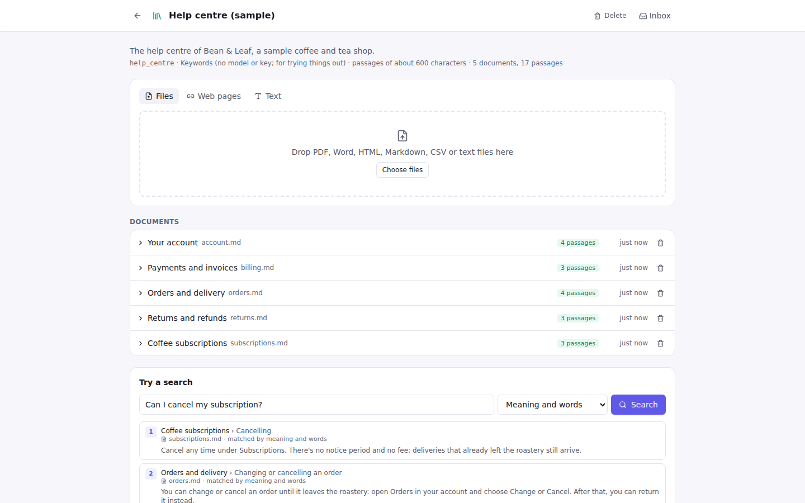

# Phase 3: report

**Status: Phase 3 (Agents and knowledge) meets its "Done when".** Work stops here for review
before Phase 4, as the build prompt asks.

The three questions in the [Phase 2 report](phase-2.md#questions-for-you) were answered
"whatever you think is right", so Phase 3 followed the recommendations:

- Knowledge Bases use **pgvector** in the Postgres that Phase 2 added. Other vector stores can
  come later.
- The default embedding model is OpenAI `text-embedding-3-small` when an OpenAI key is set.
  Otherwise it is Ollama `nomic-embed-text` when `OLLAMA_HOST` is set. Otherwise it is
  **Keywords**, a built-in, key-free option for trying things out.
- **Local (stdio) MCP servers** are Pro-only, and only commands on an approved list in Settings
  can start.

## Done when

| Done when | Evidence |
|---|---|
| The **Support bot over docs** template passes its Test Set | **12/12.** `python/src/easychain/templates/support-bot.tests.yaml` is run by `tests/test_templates.py` and by `easychain test … --stand-in`. The cases cover these behaviours: <ul><li>eight help-centre questions are answered with a citation of the right passage: password reset, refund times, where the shop ships, the returns window, deleting an account, pausing a subscription, being charged twice, tracking a parcel;</li><li>a follow-up question uses the same chat;</li><li>two off-topic questions go to a colleague through Ask a Human;</li><li>the run waits for the colleague without answering on its own.</li></ul> |
| The **SQL analyst** template passes its Test Set | **10/10.** `sql-analyst.tests.yaml`. The cases cover these behaviours: <ul><li>questions answered from the sample shop database through the agent's Database query tools: counts, the top category by revenue, the customer with the most orders, cancelled orders, the cheapest product;</li><li>a bad query is reported back and the agent fixes it;</li><li>**read-only** blocks a `DELETE`;</li><li>emailing a report **waits for approval**, then sends it once;</li><li>a **rejected** email is never sent;</li><li>the **tool-call limit** stops a runaway agent with a clear message.</li></ul> |
| (also checked in the browser) | Playwright runs the Support bot from the Home page and checks that the chat answer links `[1]` to its source. Agent tool calls and a tool approval are exercised against the real app and the fake OpenAI-compatible server. |

The Test Sets **script** the model's turns (for example "call `run_query` with this SQL, then
answer"). That makes them deterministic, and they need no key. Unscripted, the stand-in AI picks
tools and cites sources on its own, and the same flows run against real models.

## What was built

**Agents** ([docs/agents.md](../agents.md), [Agent step](../steps/agent.md))

- **Agent step** on LangChain's `create_agent`. You set the model, the role and rules (with
  `{field}`s from Flow Data), what it works on (a question or a chat), its tools and MCP tools,
  where it saves its answer, and its creativity and round limits.
- **Steps as tools.** Seven step types can be a tool: Web request, Code, Sub-flow, Knowledge Base
  search, Database query, MCP tool and Memory.
  - On the canvas you drag a step's purple handle to the agent's **Tools** handle. The tool is
    drawn as a dashed line and its card says "Tool of …".
  - A tool's arguments are the Flow Data fields it reads that the agent can't see. They are typed
    and described from the Flow Data panel.
  - Each tool keeps its own retries, time limit and "send at most once".
- **Add-ons**, each a LangChain middleware behind a toggle:
  - human approval per tool (approve, edit the arguments, or reject with a comment);
  - model and tool call limits;
  - what to do when a tool fails;
  - tool and model retries, and fallback models;
  - summarising long chats, and clearing old tool results;
  - filters for personal data (redact, mask, hash or block);
  - LLM tool selection, a to-do list and long-term memory;
  - pretend tools, for testing.
- **Live tool calls.** `tool_started` and `tool_finished` events carry the arguments, the result,
  the status and the time. Calls show under the agent on the canvas, the tool line lights up
  while a call runs, and the trace lists every call. Approvals appear in the run panel and the
  **Inbox**.
- **Structured output builder** for the AI Model and the Agent. Field types are text, number,
  whole number, yes/no, one of a list, lists and nested groups, each with a description.
  - It compiles to Pydantic models: `with_structured_output` with a retry on validation errors
    for the AI Model, and `ToolStrategy` for the Agent.
  - Each field can also be saved to Flow Data on its own.
  - Checks catch an empty shape, duplicate names, empty choices, empty groups, missing
    descriptions, and a field that clashes with where the reply is saved.
- **MCP client** (`langchain-mcp-adapters`).
  - Servers are added in **Settings → MCP servers**: streamable HTTP, SSE, or stdio for commands
    on the approved list. Tokens can be given as `{secret:NAME}`. **Show its tools** lists what a
    server offers.
  - Servers' tools can go to agents, and an **MCP tool** step calls one tool.
  - Exported code reads the servers from `EASYCHAIN_MCP_SERVERS`.
- **Import an API.** Paste an OpenAPI 3 (or Swagger 2) address or document, then pick
  operations. They become Web request steps, or tools of an agent.
  - Path, query, header and body parameters become Flow Data fields with the API's types and
    descriptions.
  - An optional key header takes its value from a secret.

**Knowledge** ([docs/knowledge.md](../knowledge.md))

- **Knowledge Bases** have their own page.
  - **Adding documents:** upload PDF, Word, HTML, Markdown, CSV, text, JSON or YAML; add web pages
    by address; or paste text.
  - **Reading documents:** happens in the background with a status (queued, processing, ready or
    error) and a reason when a document fails. Each passage records its page and heading.
  - **Chunk preview:** pick a chunk size and overlap and see how a document splits, without saving.
  - **Try a search** shows the numbered results.
- **Storage.**
  - **Postgres with pgvector:** one HNSW index per Knowledge Base.
  - **Postgres without pgvector, or SQLite:** embeddings are compared with numpy.
  - **Full-text search:** `tsvector` on Postgres, FTS5 on SQLite.
  - **Hybrid search:** reciprocal rank fusion of the two, plus a similarity floor so off-topic
    questions find nothing.
- **Embeddings** through `init_embeddings`, gated by the same key checks as chat models. Eight
  model families are offered, plus the key-free **Keywords** option.
- **Knowledge Base search step.** It searches by meaning, words or hybrid, with optional LLM
  re-ranking.
  - It saves numbered passages (`context`) and a list of sources (`sources`).
  - The run panel and chat turn `[1]` in an answer into a link to that passage's card (title,
    page, heading and how it matched).
  - As an agent tool, the agent writes its own search queries.
- **Memory step.** It can recall or remember facts about a user (the LangGraph store, one
  namespace per user), or trim or summarise a long chat. An agent's **Long-term memory** add-on
  gives it `remember` and `recall` tools.
- **Database query step** (SQLAlchemy).
  - **Read-only by default:** a read-only transaction plus a statement check.
  - **Safe values:** `{field}`s are sent as bound parameters.
  - **Describe the tables:** a second mode, for agents.
  - **Connections:** `{secret:NAME}` and `{home}` work in connection URLs, and a password written
    into a URL is flagged.
- **Exported code** includes the search helpers (the same source that runs in Easy Chain), so an
  export searches on its own. Its header and `requirements.txt` list the extra packages it needs.

**Providers**

- There are **14 providers**: OpenAI, Anthropic, Ollama, Google Gemini, Vertex AI, AWS Bedrock,
  Azure OpenAI, Mistral, Groq, Together, Fireworks, OpenRouter, DeepSeek and xAI.
- Each has a key (or credentials) and list prices for cost estimates, and the stand-in AI covers
  every one.
- Packages:
  - OpenAI, Anthropic and Ollama are always installed.
  - The rest come with `easychain[providers]` (Vertex AI with `easychain[vertex]`). A missing
    package says how to install it.
  - The Docker image and `make install` include them.
- Settings shows the four popular providers first and the rest under **More providers**.
- The AI Model's custom endpoint (Pro) can take a key from a named secret, so any
  OpenAI-compatible service works.

**Templates**

- **Support bot over docs**: chat, Memory (summarise), Knowledge Base search over a sample help
  centre, a Decision, an answer with citations, and Ask a Human for questions the docs don't
  cover. The sample Knowledge Base is built on first start, offline.
- **SQL analyst**: an Agent with three tools. Two are Database query steps on a sample shop
  database (`describe_tables`, and a read-only `run_query`). The third, `email_report`, is a Web
  request that needs approval. It has a tool-call limit and a structured answer.

**Web app**

- The canvas has the Tools handle, tool edges, "Tool of" badges and live tool calls.
- The agent inspector has tools (add a new one, or use a step already on the canvas, with an
  approval switch per tool), Add-ons and MCP tools.
- The reply format builder.
- The Knowledge page.
- Settings tabs: keys and providers, MCP servers, notifications.
- The Import an API dialog, tool approval in the run panel and Inbox, and citations.

**Fixes found by the new tests**

- A normal connection out of a tool-capable step could attach to its tool handle.
- Deleting a tool step left its approval setting on the agent.
- Passage snippets showed raw Markdown headings.
- A document that was mid-ingestion when the server restarted stayed "processing" for ever. It
  now says the restart interrupted it.

**Tests:** all passing.

| Suite | Count |
|---|---|
| Python | 320 |
| Web unit | 32 |
| Client package | 4 |
| Playwright journeys | 31 |

New Python tests cover the stand-in AI's tool calling and JSON schemas, the Agent (tool calls,
events, approvals, edits, rejections, structured answers, add-ons, limits, MCP tools) and
Knowledge Bases. The Knowledge Base tests cover:

- every file format;
- chunk provenance;
- hybrid search on SQLite and on **Postgres with pgvector**;
- the API;
- an agent searching with its own queries;
- the restart case;
- exported code searching with `easychain` not installed.

Further Python tests cover Memory, read-only SQL, MCP over stdio and HTTP with its allow-list,
OpenAPI import, golden files for every new step, and both templates.

Eight Playwright journeys are new: agent tools and live calls, tool approval, adding a tool and
an add-on, the reply format builder, Knowledge Bases (create, add text, search), the Support bot's
citations, MCP from Settings to a step run, and API import. Each also runs axe WCAG 2.2 AA scans.

## Screens

| | |
|---|---|
|  |  |
|  | |

## Demo script (about 8 minutes)

1. Start it up: `make dev`, or `docker compose up`, which now uses Postgres with pgvector. Open
   the app.
2. Support bot:
   1. **Use template → Support bot over docs**, open **Run** and ask *How long do refunds
      take?*. Click **[1]** in the answer: it jumps to the *Returns and refunds › Refunds*
      passage.
   2. Ask *What's the weather tomorrow?*. The Decision takes **Hand over** and the question
      waits in the **Inbox** for a colleague.
3. Knowledge page:
   1. Open **Knowledge → Help centre (sample)** to see its five documents and their passages.
   2. **New Knowledge Base**, then drop in a PDF or paste a page address. The document goes
      *processing → ready*.
   3. **Try a search**, and compare *Meaning*, *Words* and *Meaning and words*.
4. SQL analyst:
   1. **Use template → SQL analyst**. Three tools hang under the agent; click it to see its
      tools, the approval switch on *Email the report*, and **Add-ons** (tool-call limit 8).
   2. With a real key, ask *Which category brings in the most money?*. Watch `describe_tables`
      and `run_query` run under the agent.
   3. Ask it to *email the team*. The run waits for your approval. Edit the text, **Approve**.
5. On any flow, add an **AI Model**, set **Reply format → Fixed fields**
   (`sentiment`: one of positive/negative, `reasons`: list of text). A Decision can now read
   `sentiment` directly.
6. MCP:
   1. **Settings → MCP servers**, then add `http://localhost:8766/mcp` after running
      `uv run python -m easychain.testing.mcp_server --http 8766`.
   2. **Show its tools**, **Save**.
   3. Add an **MCP tool** step, pick `city_facts`, set `city` to `{city}`, and run it.
7. **Import an API** (top bar): paste `https://petstore3.swagger.io/api/v3/openapi.json`, tick
   two operations, and add them **as tools of** an agent.
8. **Export** the Support bot. Then set `EASYCHAIN_KNOWLEDGE_URL` to the database that holds
   your Knowledge Bases, and run the exported project on its own.

## Known gaps and risks

- **Code steps are still not sandboxed**: still Phase 4, as planned. Agents make this matter
  more, because an agent decides when a Code tool runs. Keep the server on localhost, and use
  approvals for tools that change things.
- **Ingestion runs in the API server**, in background tasks, not on the job queue. If the server
  restarts mid-document, that document is marked failed and has to be added again. Very large
  uploads hold memory in the API process. Moving ingestion onto the queue is a Phase 5 item.
- **No OCR**: scanned PDFs fail with a message saying so. **No re-crawling**: web pages are read
  once.
- **Search scale:** without pgvector, the meaning search compares every passage with numpy. That
  is fine to tens of thousands of passages and slow beyond. With pgvector, the HNSW index scales
  normally.
- **Only one vector store** (Easy Chain's own tables). No Qdrant, Chroma or Pinecone adapters yet.
- **Changing a Knowledge Base's embedding model** means making a new one. Easy Chain refuses to
  mix vector sizes, and says why.
- **MCP:** only tools are supported (no prompts or resources). Servers are reconnected per run,
  not pooled. OAuth logins for MCP servers aren't supported; tokens go in headers.
- **OpenAPI import:** optional query parameters are not sent; the step's description lists them.
  Only one security scheme (one key header) can be set at import time.
- **The stand-in AI** is keyword-based. It shows the flow's wiring, not how a real model would
  choose. Its answers are clearly labelled.
- **Agents with real models are not run in CI** (no keys, by design). Test Sets with scripts and
  the stand-in cover the flow logic. Real-model behaviour should be checked by hand before a
  release.
- **Fetching on the server:** adding a web page or an OpenAPI address makes the server fetch that
  URL. That is fine for a local single-user install. A shared deployment needs an egress
  allow-list (Phase 5, with roles).
- **Docker Compose now uses `pgvector/pgvector:pg16`** (Debian-based) instead of
  `postgres:16-alpine`. An existing Compose volume should be reindexed (`REINDEX DATABASE
  easychain;`) after the switch, because the C library's collation differs.

## Phase 4 plan: Autopilot and teams

The build prompt's Phase 4 scope: Deep Agents, Helpers, Skills, **sandboxes** for Code steps,
multi-agent patterns, and a describe-it copilot. The original brief isn't in the repo (see
[docs/handover/build-prompt.md](../handover/build-prompt.md)), so the "Done when" below is
proposed. Please confirm it or give the original.

**Proposed "Done when":**

1. A **Research assistant** template passes its 10-case Test Set. It is a Deep Agent that plans
   with a to-do list, hands sub-tasks to two Helpers, and writes a report to its files.
2. A Code step can't read the host's files or reach the network outside its allow-list. Escape
   tests prove this.

The work:

1. **Sandboxes for Code steps** (first, because agents now call Code tools).
   - Run each Code step in an isolated process with CPU, memory and time limits, no host file
     system, and network only to allowed hosts.
   - Backends: **Docker or gVisor** (`runsc`) locally and in Compose. A plugin interface leaves
     room for hosted sandboxes (E2B, Modal).
   - Packages per flow from an allow-list, cached.
   - Exported code keeps running Code steps in-process, with a comment saying so.
2. **Deep Agent step** on LangChain's `deepagents` (`create_deep_agent`):
   - planning (to-do list);
   - a virtual file system (in the store, so it survives restarts);
   - **Helpers** (sub-agents): each with its own role, tools and model, shown nested in the
     trace;
   - approvals on chosen tools, reusing Phase 3's Add-ons.
3. **Skills**: reusable bundles of instructions, files and tools (the Agent Skills format) that
   an agent loads when they're relevant. They are kept in a Skills library in the workspace.
4. **Multi-agent patterns** as templates and canvas helpers:
   - **supervisor** (one agent routes to others);
   - **handoffs / swarm** (agents pass the conversation, with `Command(goto)`);
   - **plan-and-execute**.
   - Each is drawn with ordinary steps, so it stays editable and exportable.
5. **Describe-it copilot**: a side panel where you describe what you want ("answer support
   emails from our docs and ask me before refunds"). It proposes a flow as a reviewable diff on
   the canvas (new steps, settings and Test Set cases), and it fixes problems from the checks. It
   is built on the flow spec and the same checks people see.
6. **Templates:** Research assistant (Deep Agent + Helpers), Inbox triage (supervisor), each
   with a 10-case Test Set.

## Questions for you

1. **Phase 4 "Done when"**: are the two criteria above right? Or paste the original brief's
   Phase 4 section, or commit the brief as `docs/handover/build-prompt.original.md`.
2. **Sandbox backend**: Docker (works on any machine with Docker, the Compose setup already has
   it) as the default, with gVisor where available? Or should a hosted sandbox (E2B) be the
   default, so it needs no local Docker?
3. **The copilot's model**: use whichever model the user has a key for, with the stand-in AI
   showing a canned example otherwise? Or require a capable model (for example Claude Sonnet or
   GPT-4.1 class) and say so?
